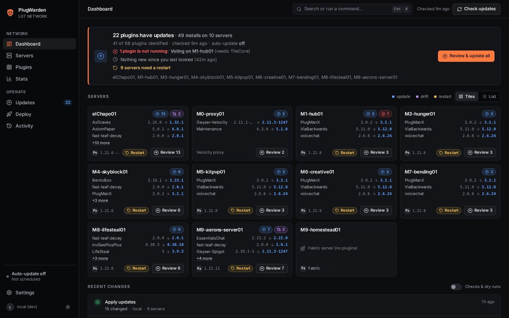
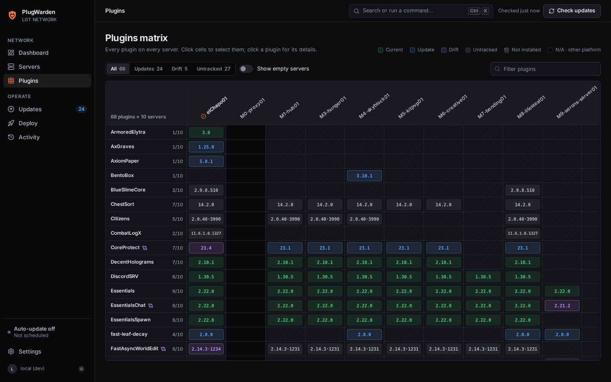
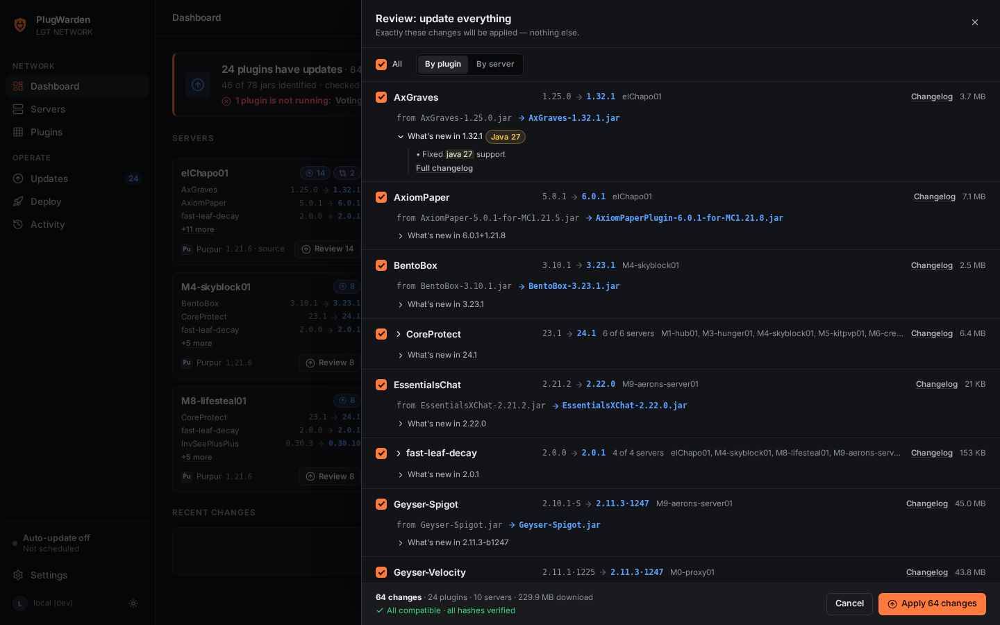
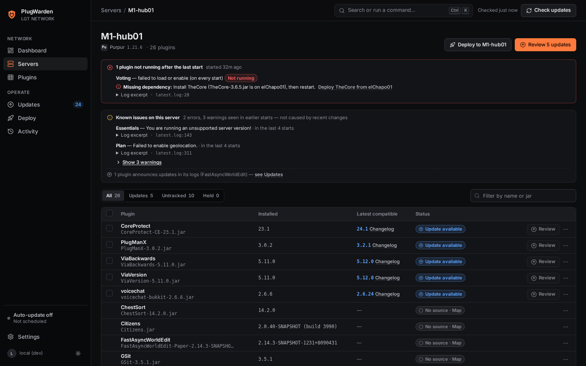
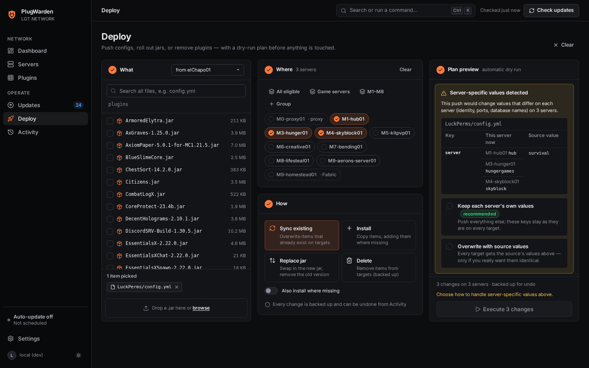
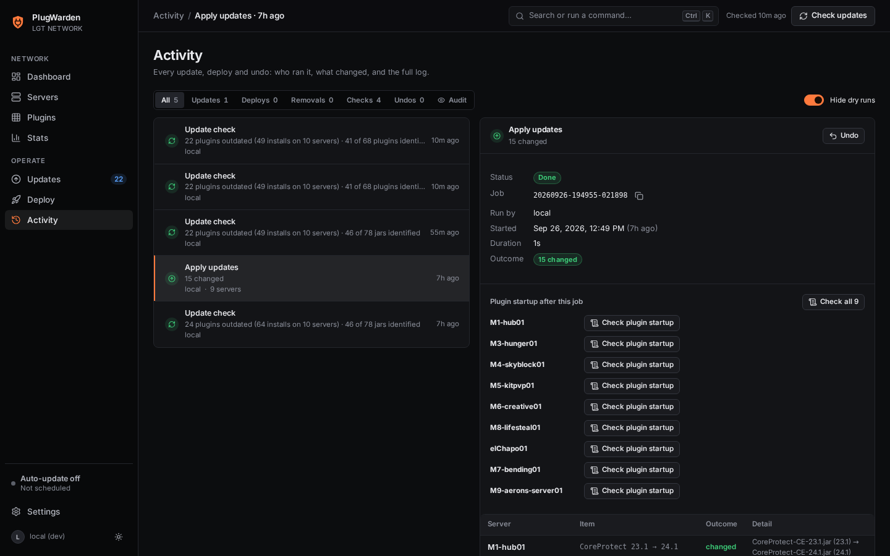
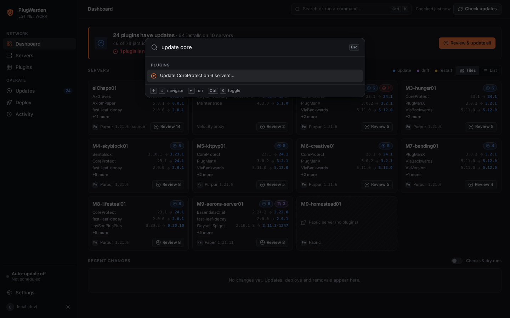
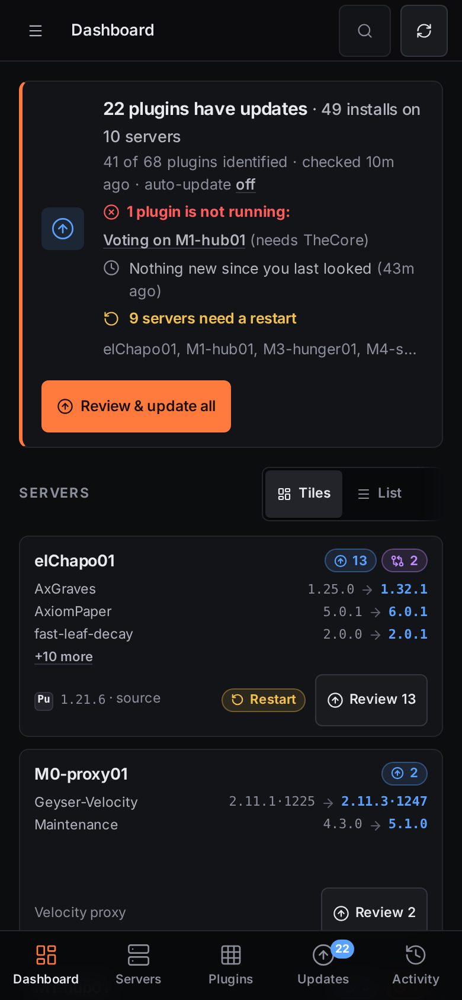

<div align="center">


# PlugWarden

Plugin management for Minecraft networks that run on [CubeCoders AMP](https://cubecoders.com/AMP).



</div>

## About

I run a small Minecraft network on AMP: a Velocity proxy, a hub, and a handful of game-mode servers. Keeping plugins current across all of them meant opening each instance's file manager, uploading the same jar over and over, deleting the old versioned jar, and hoping I didn't miss a server. Copying config files between servers was even riskier. Push `LuckPerms/config.yml` to every server and they all end up believing they're the same server.

PlugWarden is the tool I built to fix that. It reads your AMP datastore directly, shows you every plugin on every server in one place, tells you what's out of date, and lets you update or push configs across the whole network with a preview first and an undo afterwards.

It doesn't need AMP API credentials, it doesn't install anything on your game servers, and it doesn't change a single file until you tell it to.

## How it compares to the AMP Store

AMP 2.7 added a Store for installing plugins into an instance. It's good at that, and PlugWarden works fine next to it. The difference is scope: the Store works on one instance at a time, while PlugWarden looks at the whole network.

| | AMP Store | PlugWarden |
|---|---|---|
| Install plugins from Modrinth or Hangar | Yes, per instance | Use the Store, or Deploy from a source server |
| Find updates for jars you installed by hand | No | Yes, by file hash |
| See every plugin on every server in one table | No | Yes |
| Spot servers running a different version than the rest | No | Yes |
| Update the whole network in one reviewed batch | No | Yes |
| Push configs but keep each server's own values | No | Yes |
| Check that a plugin actually started after an update | No | Yes, from the server logs |
| Canary rollouts and automatic updates with limits | No | Yes |
| Undo changes and keep an audit log | No | Yes |

<sub>The AMP Store column is based on the AMP 2.7 and 2.8 release notes.</sub>

## Features

### Dashboard

Each server gets a tile listing what's outdated (current version and latest version), whether it's drifted from the rest of the network, whether it needs a restart, and whether any plugin failed to start. The headline at the top sums up the network and shows what changed since your last visit.

### Plugin matrix

One row per plugin, one column per server. Green cells are current, blue cells have an update, and purple cells are running a different version than most of your network. You can select cells and act on them directly.



### Updates you review first

Every Update button opens the same review sheet. It lists each server and plugin with the old jar, the new jar, whether the new build supports your Minecraft version, whether the download hash checks out, and a few lines from the changelog. Words like "breaking", "migration" or a Java version requirement get highlighted so they're hard to miss.

When you hit Apply, PlugWarden installs exactly what you reviewed. If a jar on disk changed in the meantime, it stops and asks you to review again. It also removes the old versioned jar, so you never end up with two copies of the same plugin.



PlugWarden identifies each jar by its SHA-1 hash and looks it up on Modrinth, filtered by your server's platform and Minecraft version. Plugins that aren't on Modrinth can be pointed at Hangar, Spiget or a GitHub repository in Settings. Jars you uploaded by hand are recognised the same way as anything else.

### Startup checks

After a server restarts, PlugWarden reads its logs and compares this start with earlier ones. If a plugin failed to load or switched itself off, it shows up as "Not running" with the likely cause and what to do about it. For a missing dependency that another server already has, there's a link that opens Deploy with everything filled in.

Errors that were already there before the update are listed separately under "Known issues", so a new problem doesn't get lost among old ones.



### Deploying configs safely

Deploy copies jars, folders or single config files from a source server to the servers you pick. It always starts with a dry run that shows what would change on each server, including a diff of each file. Passwords, tokens and webhook URLs are hidden in the diffs.

Some config values are supposed to be different on every server: LuckPerms `server:`, CoreProtect `table-prefix`, Plan's server name and UUID, DiscordSRV channel IDs. PlugWarden spots these and asks you what to do. If you choose to keep each server's values, it copies the rest of the file and leaves those lines alone, comments and formatting included. If a file is too complex to merge safely, PlugWarden skips it and tells you.



Folder copies leave live data alone by default. Databases, `userdata/`, `playerdata/`, logs and caches are skipped unless you turn that on yourself, and any file a folder sync would delete is listed in red before anything happens.

### Undo and audit log

Before changing a file, PlugWarden backs it up, and you can undo any job from the Activity page. The log also records who ran each job (from your Cloudflare Access login) and who viewed which config file.



### Automatic updates

These are off by default. If you turn them on, PlugWarden only installs release builds that are at least 48 hours old and whose download hash it could verify. It installs them on one canary server first, waits for that server to restart and load the plugin without errors, gives it 24 hours, and then rolls the update out to the rest inside the maintenance window you set, with a cap on how many changes happen per run. If a plugin fails on the canary, that version is held back and never retried automatically.

### Keyboard and mobile

Press Ctrl+K (or Cmd+K) to open the command palette. It understands actions, so typing "update core" offers to update CoreProtect on every server that has it. `j` and `k` move through lists, the arrow keys move around the matrix, and `?` lists every shortcut. There's a light and a dark theme, and the whole thing works on a phone.

<table>
<tr>
<td width="62%"></td>
<td width="38%"></td>
</tr>
</table>

## How it works

AMP keeps each instance in a folder inside its datastore. PlugWarden mounts that folder and works with the plugin directories directly:

```
<datastore>/                      for example /home/amp/.ampdata/instances
  Proxy01/Minecraft/plugins/      Velocity proxy, handled separately
  Hub01/Minecraft/plugins/
  Survival01/Minecraft/plugins/
  ...
```

- Every instance with a `Minecraft/plugins` folder counts as a server. The platform (Paper, Purpur, Velocity, Fabric or generic Bukkit) and the Minecraft version are read from the instance's files.
- Each jar's `plugin.yml`, `paper-plugin.yml` or `velocity-plugin.json` gives its name and version, and its hash identifies the exact build. The Bukkit and Velocity builds of a plugin like LuckPerms are tracked separately.
- Changes are made with `rsync`, one item at a time, after a dry run, with backups for undo. The container runs as your AMP user, so file ownership doesn't change.
- Startup checks read `Minecraft/logs/latest.log` and the older `*.log.gz` files. Nothing runs inside your game servers.

PlugWarden never restarts servers. It tells you which ones need a restart, and you mark them as done once you've restarted them.

## Installation

You'll need a Linux host running AMP and Docker with the Compose plugin. I also recommend putting it behind a Cloudflare Tunnel with Cloudflare Access, since that's how PlugWarden handles logins.

```bash
git clone https://github.com/mk7luke/plugwarden.git /opt/plugwarden
cd /opt/plugwarden

cp .env.example .env
chmod 600 .env
mkdir -p data
sudo chown "$(id -u amp):$(id -g amp)" data
sudo chmod 700 data
```

Open `.env` and set your datastore path, your AMP user's IDs (`id -u amp` and `id -g amp` print them) and your Cloudflare Access details:

```ini
AMP_DATASTORE=/home/amp/.ampdata/instances
LGT_BASE_OVERRIDE=/home/amp/.ampdata/instances
PLUGWARDEN_UID=1001
PLUGWARDEN_GID=1001
LGT_CF_TEAM_DOMAIN=yourteam.cloudflareaccess.com
LGT_CF_AUD=<the AUD tag of your Access application>
LGT_HOSTNAME=plugins.example.com
```

Then start it:

```bash
docker compose up -d --build
curl -s http://127.0.0.1:8078/healthz
```

The health check should print `{"ok":true}`. PlugWarden only listens on `127.0.0.1`, so point your Cloudflare Tunnel at `http://localhost:8078`, open your hostname, log in through Access and click Check updates.

If you don't use Cloudflare, you can run it without authentication for a quick look, as long as it's only reachable from the machine itself. Set `LGT_AUTH=none`, leave `LGT_HOSTNAME` empty, and connect through an SSH tunnel with `ssh -L 8078:127.0.0.1:8078 your-host`.

### Settings in `.env`

| Variable | Example | Purpose |
|---|---|---|
| `AMP_DATASTORE` | `/home/amp/.ampdata/instances` | Where your AMP datastore lives on the host. It's mounted at the same path in the container. |
| `PLUGWARDEN_UID`, `PLUGWARDEN_GID` | `1001` | Your AMP user's IDs, so files keep the right owner. |
| `LGT_BASE_OVERRIDE` | `/home/amp/.ampdata/instances` | The datastore path as the app sees it. Same value as above. |
| `LGT_AUTH` | `cf-access` | Check the Cloudflare Access login on every request. |
| `LGT_CF_TEAM_DOMAIN` | `yourteam.cloudflareaccess.com` | Your Cloudflare Zero Trust team domain. |
| `LGT_CF_AUD` | `4f1c...e9` | The Audience (AUD) tag of your Access application. |
| `LGT_HOSTNAME` | `plugins.example.com` | The public hostname. Requests for any other host are rejected. |
| `LGT_ALLOWED_HOSTS` | | Extra hostnames to accept, separated by commas. |
| `LGT_CONTACT` | `you@example.com` | Contact address sent to Modrinth and other APIs in the User-Agent. |
| `LGT_MIN_FREE_GB` | `2` | New jobs are refused when free disk space drops below this. |

Everything else, like the default source server, server groups, update sources, pinned and ignored plugins, the auto-update policy and backup retention, is set on the Settings page.

More detail on deployment and security is in [dev/DEPLOY_NOTES.md](dev/DEPLOY_NOTES.md).

## Safety

- Finding servers, checking for updates and reading logs never write anything to your servers.
- Updates and deploys apply the plan you reviewed, or nothing at all.
- Every change is backed up first and can be undone. Old backups are cleaned up automatically so they don't fill your disk.
- Folder copies skip live data by default, and values that differ per server need an explicit choice.
- Bukkit plugins are never copied to a Velocity proxy, and Velocity plugins never land on a game server.
- Logins are verified against Cloudflare Access. Unknown hostnames and cross-site requests are rejected, a strict Content Security Policy is applied, secrets are hidden in diffs, and every change is logged.

## FAQ

**Does it replace AMP?**
No. Keep using AMP for consoles, restarts, schedules and backups. PlugWarden only deals with plugins and plugin configs.

**Does it work with plugins installed through the AMP Store?**
Yes. PlugWarden identifies jars by their hash, so it doesn't matter how they were installed.

**Which servers does it support?**
Paper, Purpur and other Bukkit-based servers such as Spigot, plus Velocity proxies. Fabric instances show up in the list, but PlugWarden doesn't manage mods.

**What about plugins that aren't on Modrinth?**
They show up as untracked. You can link them to Hangar, Spiget or a GitHub repository under Settings, or keep deploying them as jars from your source server.

**Does it need my AMP login or the AMP API?**
No. It only needs access to the datastore folder, running as your AMP user.

## Development

```bash
python3 -m venv .venv
.venv/bin/pip install -r requirements.txt pytest playwright
.venv/bin/python -m pytest -q               # run the tests
dev/serve.sh                                # dev server on 127.0.0.1:18095
.venv/bin/python dev/a11y_focus.py          # keyboard focus checks
.venv/bin/python dev/readme_shots.py        # regenerate the screenshots
```

Always work against a copy of a datastore (`LGT_SANDBOX=/path/to/sandbox dev/serve.sh`), never a live one. The backend is FastAPI and the frontend is Preact with htm, with no build step. See [CONTRIBUTING.md](CONTRIBUTING.md) if you'd like to help.

## License

MIT. PlugWarden is not affiliated with CubeCoders, Mojang or Modrinth.
